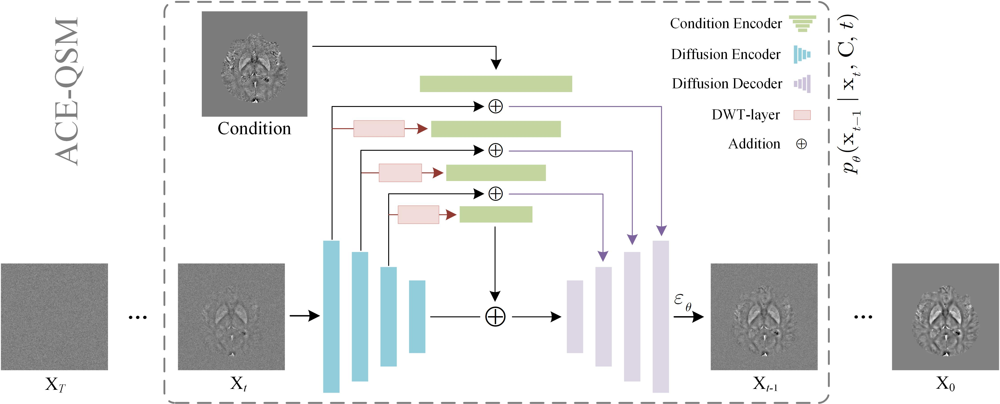

# ACE-QSM: Accelerating quantitative susceptibility mapping acquisition using diffusion models by reducing repetition time

## Overview
We provide the PyTorch implementation of our BSPC submission ["ACE-QSM"](https://doi.org/10.1016/j.bspc.2025.108217).




## Files description
ACE-QSM contains the following folders:


├── data  &nbsp;&nbsp;&nbsp;&nbsp;  
&nbsp;&nbsp;&nbsp;&nbsp;&nbsp;&nbsp;&nbsp;&nbsp;&nbsp;&nbsp;├── ACE-QSM_processed &nbsp;&nbsp;&nbsp;&nbsp;\\ A folder to save the processed dataset  
&nbsp;&nbsp;&nbsp;&nbsp;&nbsp;&nbsp;&nbsp;&nbsp;&nbsp;&nbsp;├── ACE-QSM_raw\
&nbsp;&nbsp;&nbsp;&nbsp;&nbsp;&nbsp;&nbsp;&nbsp;&nbsp;&nbsp;&nbsp;&nbsp;&nbsp;&nbsp;&nbsp;&nbsp;&nbsp;&nbsp;&nbsp;&nbsp;├── Dataset001_iLSQR  &nbsp;&nbsp;&nbsp;&nbsp;\\ A raw data folder for iLSQR  
&nbsp;&nbsp;&nbsp;&nbsp;&nbsp;&nbsp;&nbsp;&nbsp;&nbsp;&nbsp;&nbsp;&nbsp;&nbsp;&nbsp;&nbsp;&nbsp;&nbsp;&nbsp;&nbsp;&nbsp;└── ......  
&nbsp;&nbsp;&nbsp;&nbsp;&nbsp;&nbsp;&nbsp;&nbsp;&nbsp;&nbsp;└── ACE-QSM_results &nbsp;&nbsp;&nbsp;&nbsp;\\ A folder to store the trained dataset results  
└── src  
&nbsp;&nbsp;&nbsp;&nbsp;&nbsp;&nbsp;&nbsp;&nbsp;&nbsp;&nbsp;├── execution &nbsp;&nbsp;&nbsp;&nbsp;\\ store the running scripts  
&nbsp;&nbsp;&nbsp;&nbsp;&nbsp;&nbsp;&nbsp;&nbsp;&nbsp;&nbsp;├── network &nbsp;&nbsp;&nbsp;&nbsp;\\ store the model  
&nbsp;&nbsp;&nbsp;&nbsp;&nbsp;&nbsp;&nbsp;&nbsp;&nbsp;&nbsp;└── scripts  &nbsp;&nbsp;&nbsp;&nbsp;\\ functional codes  


## Usage

### Install requirements

pip install -r requirements.txt

### Preprocess
```python
python preprocess.py \
    -r [ACE-QSM_raw folder] \
    -p [ACE-QSM_processed folder] \
    -D [dataset_ID]
```

### Train

Train diffusion model
```python
python diffusion_train.py \
    -p [ACE-QSM_processed folder] \
    -r [ACE-QSM_results folder] \
    -D [dataset_ID] -T [task_name] \
    -denoiser [diffusion_net|DWTDenoiserNet] \
    -sintr [save_interval|5000] \
    -iters [iteration|600000] \
    -devices [cpu_or_gpu-index] \
    -f [fold|0] --c
```

Train normal U-Net
```python
python normal_train.py \
    -p [ACE-QSM_processed folder] \
    -r [ACE-QSM_results folder] \
    -D [dataset_ID] -T [task_name] -N BaseUNet \
    -b [batch_size] -d [cpu_or_gpu-index] -e [epochs|200] --c
```

### Infer
```python
python diffusion_infer.py \
-data_dir [imput_dir|"../../data/Infer_samples"] \
-task_dir [join(ACE-QSM_results, task_name)] \
-method [inversion_method|"iLSQR"] -device [cpu_or_gpu-index]
```
